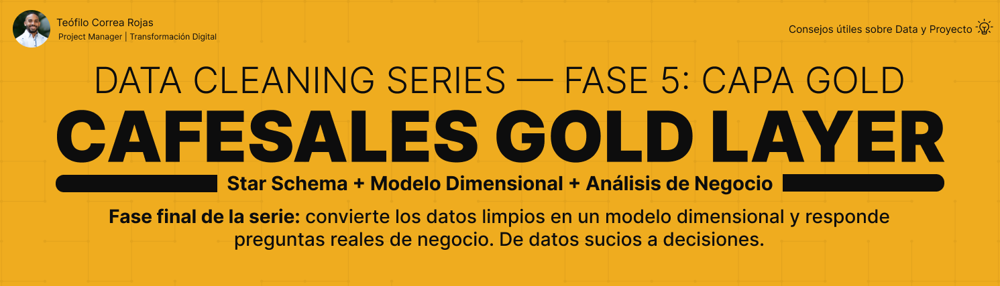
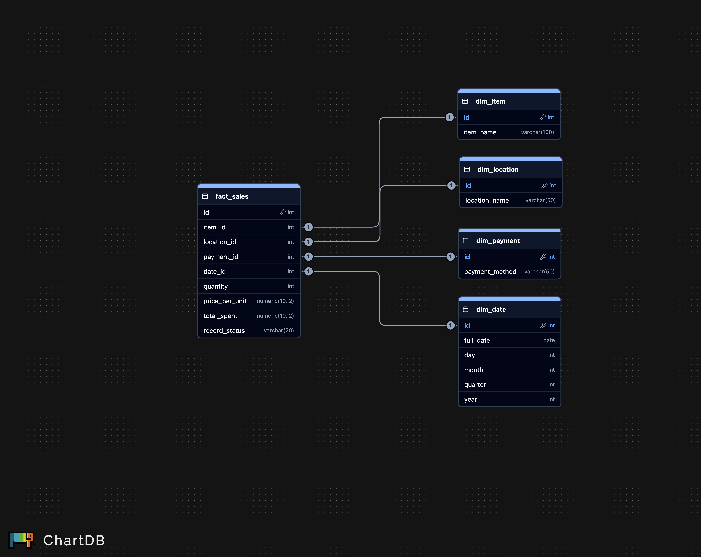

# CafeSales — Gold Layer



## 📌 Descripción

Quinta y última fase de una serie de limpieza de datos en PostgreSQL.
Este proyecto transforma los datos limpios de la capa Silver en un
**modelo dimensional Star Schema** y responde preguntas de negocio
sobre ventas, tiempo y comportamiento de compra.

Cierra el ciclo completo de una plataforma de datos:
**datos sucios → datos limpios → modelo → decisiones**.

---

## 🎯 Objetivos del proyecto

- Diseñar un modelo dimensional Star Schema (4 dimensiones + fact)
- Construir dimensiones a partir de una sola entidad (Silver)
- Crear una dimensión de tiempo desglosada con EXTRACT
- Implementar el ETL con Surrogate Key Lookup (Silver → Gold)
- Manejar los valores faltantes como categoría 'Unknown'
- Responder preguntas de negocio con análisis multi-perspectiva

---

## 🏗️ Contexto — Arquitectura Medallion

```
Arquitectura Medallion
│
├── STG ← Fase 2 (datos crudos)
├── Bronze ← Fase 3 (auditoría)
├── Silver ← Fase 4 (limpieza)
└── Gold ← este proyecto (modelo + análisis) ⭐
```


La capa Gold es la capa analítica final. A diferencia de Silver
(datos limpios en una tabla plana), Gold usa un modelo dimensional
optimizado para análisis y reportería de negocio.

---

## 🌟 Modelo Star Schema



```
              gold.dim_item
                    │
gold.dim_payment ───┼─── gold.dim_location
                    │
             gold.fact_sales
                    │
              gold.dim_date
```


**Star Schema puro:** las dimensiones no se conectan entre sí. Solo
`fact_sales` tiene FK hacia las 4 dimensiones. Cada dimensión es un
catálogo de valores únicos; la fact registra cada transacción.

---

## 📊 Tablas del modelo

| Tabla | Tipo | Descripción |
|---|---|---|
| `gold.dim_item` | Dimensión | Productos vendidos |
| `gold.dim_location` | Dimensión | Ubicaciones de venta |
| `gold.dim_payment` | Dimensión | Métodos de pago |
| `gold.dim_date` | Dimensión | Fechas desglosadas (día, mes, trimestre, año) |
| `gold.fact_sales` | Hechos | Cada transacción con medidas y FK |

---

## 🔑 Conceptos clave aplicados

| Concepto | Descripción |
|---|---|
| Star Schema | Modelo dimensional con la fact en el centro |
| Dimensión vs Fact | Catálogo único vs eventos repetidos |
| `COALESCE` | NULL de Silver → 'Unknown' en las dimensiones |
| `EXTRACT` | Desglose de fechas en dim_date |
| Surrogate Key Lookup | Traducción de nombres Silver → IDs Gold vía JOIN |
| FK modular | Foreign keys con ALTER TABLE (add_constraints) |

---

## 🔄 El reto — ETL de fact_sales

La carga de la fact es el paso más complejo. Combina Silver con las
4 dimensiones para traducir cada nombre a su ID de Gold, y excluye
las ventas sin fecha del modelo:

```sql
INSERT INTO gold.fact_sales (
    item_id, location_id, payment_id, date_id,
    quantity, price_per_unit, total_spent, record_status
)
SELECT
    di.id, dl.id, dp.id, dd.id,
    s.quantity, s.price_per_unit, s.total_spent, s.record_status
FROM silver.sales AS s
INNER JOIN gold.dim_item AS di
    ON COALESCE(s.item, 'Unknown') = di.item_name
-- + JOINs a location, payment y date
WHERE s.transaction_date IS NOT NULL;
```

---

## 📈 Análisis de negocio

| Perspectiva | Preguntas que responde |
|---|---|
| 🟡 Ventas | Productos top, ingresos, ticket promedio |
| 🟠 Temporal | Ventas por mes, por día, tendencia mensual |
| 🔵 Comportamiento | Método de pago preferido, ventas por ubicación |

Cada consulta filtra `record_status = 'active'` para calcular
ingresos solo sobre ventas completas.

---

## 🧱 Estructura del proyecto

```
CafeSales_Gold_Layer/
│
├── asset/
│ ├── banner_gold.png
│ └── diagram_star_schema.png
│
├── docs/
│ └── project_closure.md
│
├── sql/
│ └── 04_gold/
│ ├── star_schema_design.md
│ ├── data_dictionary_gold.md
│ ├── create_tables/
│ ├── add_constraints/
│ ├── insert_data/
│ ├── analytics/
│ └── README.md
│
├── .gitignore
└── README.md
```


---

## 🚀 Cómo usar

```
1.Crear las 4 dimensiones (create_tables/)
2.Crear fact_sales y agregar las FK (add_constraints/)
3.Cargar las dimensiones (insert_data/ 01-04)
4.Cargar la fact table (insert_data/ 05)
5.Ejecutar los análisis (analytics/)
```


El orden importa: las dimensiones se cargan antes que la fact,
porque las FK necesitan que los IDs ya existan.

---

## 🔜 Fases del proyecto

| Fase | Proyecto | Enfoque |
|---|---|---|
| 1 | [CafeSales_Database_Infrastructure](https://github.com/teofilocorrea/CafeSales_Database_Infrastructure) | Infraestructura ✅ |
| 2 | [CafeSales_STG_Layer](https://github.com/teofilocorrea/CafeSales_STG_Layer) | Datos crudos ✅ |
| 3 | [CafeSales_Bronze_Layer](https://github.com/teofilocorrea/CafeSales_Bronze_Layer) | Auditoría ✅ |
| 4 | [CafeSales_Silver_Layer](https://github.com/teofilocorrea/CafeSales_Silver_Layer) | Limpieza ✅ |
| 5 | CafeSales_Gold_Layer | Modelo + análisis ← estás aquí |

---

## 👤 Autor

### Teófilo Correa Rojas

**Project Manager Digital | Data analytic**

🔗 [LinkedIn](https://www.linkedin.com/in/teófilo-correa-rojas/)